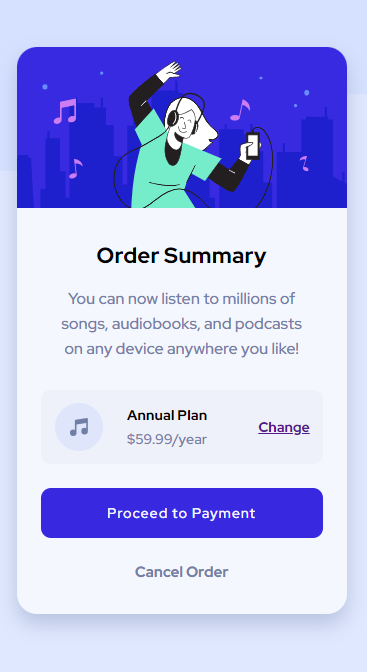
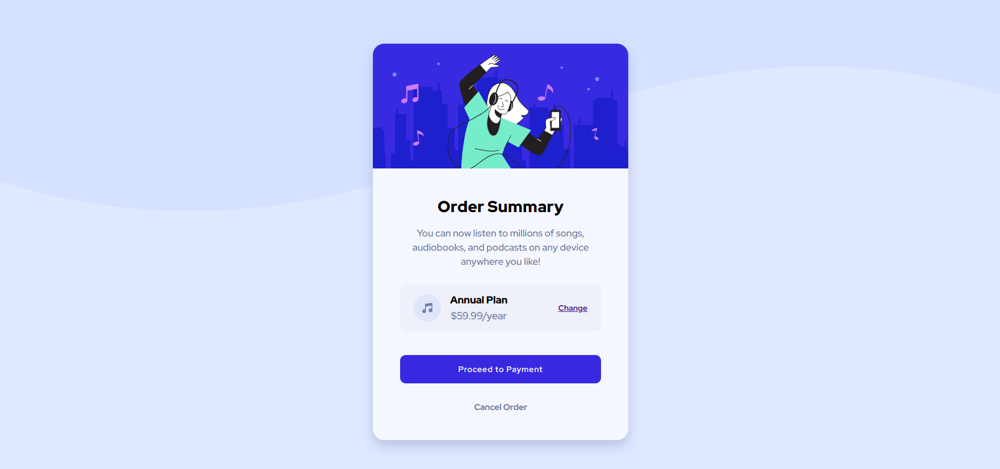

Frontend Mentor

---

<h2>Order summary card solution</h2>

This is a solution to the [Order summary card challenge on Frontend Mentor](https://www.frontendmentor.io/challenges/order-summary-component-QlPmajDUj).

---

<h3>Finished Screenshots</h3>

<a href="https://fementor-af-order-summary-component.netlify.app">Live Site URL</a>

---

<h4>Built with:</h4>

   

Semantic HTML5 markup

SCSS custom properties

Flexbox

CSS Grid

Mobile-first workflow

Media Queries

Pixel Perfecting with PerfectPixel Chrome extension

Netlify used for deployment

---

<h3>Author</h3>
<a href="https://www.andreferreiradev.com/">andreferreiradev.com</a>

<a href="https://www.frontendmentor.io/profile/Namonaki0">frontendmentor.io/profile/Namonaki0</a>

